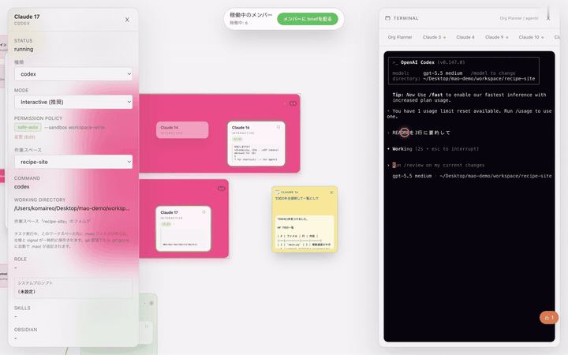

# Genba (現場)

See where your AI agents are actually working.



Genba is a desktop management plane for the AI CLI agents you already run —
Claude Code, Codex, Gemini CLI, Grok, and custom commands — on one live board.
Your folder hierarchy is drawn as a tree and folders glow while agents work
inside them. Click in and you are talking to the **real CLI session, not a
wrapper**: agents live in a tmux session that outlives the app, so you can
quit Genba, keep the agents working, relaunch, and the board reattaches.
Approvals and errors land in one inbox.

Genba is a source-available project. **Individual use is free forever —
including at work and on commercial projects.** A commercial license is
required only when an organization adopts Genba as a standard tool.

Commercial hosted competing services are not allowed. You may not offer Genba, a
modified Genba, or a substantially similar derivative as a hosted SaaS, cloud
service, managed service, hosted agent-orchestration service, or competing
automation platform without a separate written commercial license.

License details are in [LICENSE](LICENSE). Third-party dependency notices are
in [THIRD_PARTY_NOTICES.md](THIRD_PARTY_NOTICES.md).

Genba, Genba OS, and Genba Cloud are trademarks and brand names of Reo Komai. See
[TRADEMARKS.md](TRADEMARKS.md).

Official repository:
[github.com/Reo-KU/genba](https://github.com/Reo-KU/genba)

Issues:
[GitHub Issues](https://github.com/Reo-KU/genba/issues)

Licensing and commercial inquiries:
[imopotato8@gmail.com](mailto:imopotato8@gmail.com)

> Genba does not bundle Claude, Codex, Gemini, Grok, GPT, or other agent CLIs.
> It starts the commands you configure, and each CLI remains governed by its
> own vendor terms.

## Features

- **Real sessions, not wrappers**: agents run in a tmux session that outlives
  the app. Quit Genba and they keep working; relaunch and the board
  reattaches. You can even `tmux attach` from any terminal to watch the same
  session
- **Workspace tree**: your folder hierarchy drawn as a left-to-right tree —
  folders with running agents glow in their branch color; click a workspace
  to expand the agent cards inside, click a card to talk to that session
- **Attention Inbox**: approvals, errors, and anything else needing a human
  decision, collected in one place across all workspaces
- **Zero-setup first run**: Genba detects your installed CLIs and recent
  project folders and lays out an initial board automatically
- **Sticky notes**: write a task, drop it on an agent for a one-shot run —
  the result is written back onto the note
- Interactive agent terminals backed by tmux (rendered with xterm.js)
- Support for Claude, Codex, Gemini, Grok, and custom allowlisted commands
- Per-agent execution modes and permission policy controls
- Per-agent skills directory and enabled skill hints
- Per-agent Obsidian vault access guidance
- Persistent task artifacts under `mao_artifacts/`
- Temporary Genba control files under `.mao/`

## Requirements

Required:

| Tool | Why |
|---|---|
| Node.js 20+ | App runtime and build tooling |
| tmux | Interactive agent session backend |

Optional agent CLIs:

| CLI | Typical use |
|---|---|
| `claude` | Claude Code agents and organization planner |
| `codex` | Codex agents |
| `gemini` | Gemini CLI agents |
| `grok` | Grok CLI agents |
| `sh`, `bash`, `zsh`, `python`, `python3`, `node` | Custom local commands |

Install and authenticate the CLIs you want to use before adding them as agents.

## Development

```sh
npm install
npm run dev
```

Build:

```sh
npm run build
```

Package:

```sh
npm run dist
```

## Workspace Files

Genba stores app-level workspace state under:

```text
~/.multi-agent-orchestrator/workspaces/default/
```

Inside each agent working directory, Genba may create:

| Path | Purpose |
|---|---|
| `.mao/` | Temporary control files, briefs, dispatches, and completion signals |
| `mao_artifacts/` | Persistent task outputs created by agents |

`.mao/` is control state and may be cleaned or regenerated. Do not store final
deliverables there. Use `mao_artifacts/` for outputs that should survive
organization saves and task cleanup.

## Obsidian Memory

Each agent can optionally be given an Obsidian vault path. When configured, Genba
uses the vault as durable organizational memory:

You only need to create or choose the vault folder itself. The `MAO/` memory
folder inside the vault is created automatically when you save the organization
or start a task.

```text
Obsidian Vault/
  MAO/
    organization.md
    agents/
      <agent>.md
    tasks/
      <taskId>.md
    decisions/
```

Organization saves update `organization.md` and each active agent note. Task
starts create a task note, and agent completions append result summaries,
dispatches, and artifact paths to that task note. Interactive sessions can still
hold short-term conversation context, while Obsidian keeps the long-term memory
needed to recover after restarts or context loss.

## License Summary

Genba is licensed under the Business Source License 1.1 — not open source,
but source-available: you can audit every line that touches your sessions.

**Individual use is free forever — including at work and on commercial
projects.** A commercial license is required only when an organization adopts
Genba (standardizes on it, procures it for members, or deploys it centrally).
Evaluation inside an organization is free.

Each released version converts to the Apache License 2.0 four years after that
version is first publicly distributed.

This summary is not a substitute for [LICENSE](LICENSE).

## Contributing

Pull requests are welcome. Please read [CONTRIBUTING.md](CONTRIBUTING.md)
before submitting changes.
